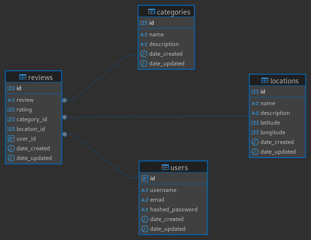

# Map My World: Backend

---

Welcome to the **Map My World** backend! This is the foundation of our application, designed for you to explore, review, and share discoveries about various places and categories in our world. Our main goal is to connect people through shared experiences and the discovery of new locations.

---

## Key Features

* **Location Exploration:** Discover and manage diverse locations with details like name, description, category, and geographical coordinates.
* **Category Management:** Organize places by categories, ensuring uniqueness for better classification.
* **Reviews and Ratings:** Allows users to leave reviews and rate locations, enriching the available information.
* **Smart Suggestions:** Offers suggestions for nearby places, prioritizing those without recent reviews to encourage exploration.
* **Robust API:** Built with **FastAPI** for fast performance and interactive documentation.

---

## Technologies Used

This project was developed using the following key tools and libraries:

* **FastAPI**: High-performance web framework for building APIs.
* **PostgreSQL**: Robust and scalable relational database.
* **Docker**: Tool for containerizing applications, facilitating deployment.
* **SQLAlchemy**: SQL Toolkit and Object-Relational Mapper (ORM) for Python.
* **Alembic**: Database migration tool for SQLAlchemy.
* **Ruff**: High-speed Python linter and formatter.
* **pytest**: Testing framework for Python, used for unit and integration tests.
* **uv**: An extremely fast Python package and project manager, written in Rust.

---

## Prerequisites

Before you start, make sure you have the following programs installed:

* **Docker**: Essential for running the application in a containerized environment. You can find installation instructions in the [official Docker documentation](https://docs.docker.com/get-docker/).
* **Git**: Necessary for cloning the project repository. Installation instructions are available in the [official Git documentation](https://git-scm.com/downloads/linux/).

---

## Installation and Setup

These instructions are designed for Linux-based systems but are easily adaptable to other operating systems.

1.  **Clone the repository:**
    ```bash
    git clone https://github.com/rokujs/technical_test_orbidi.git
    ```
2.  **Navigate to the project directory:**
    ```bash
    cd technical_test_orbidi
    ```
3.  **Build the Docker image:**
    ```bash
    docker compose build
    ```
4.  **Start the services:**
    ```bash
    docker compose up -d
    ```
5.  **Access the application container (backend):**
    ```bash
    docker compose exec backend bash
    ```
6.  **Run database migrations:**
    ```bash
    shell
    migrate
    ```

That's it! The **Map My World** backend is now running on your machine.

---

## Verification and API Access

You can verify that everything is working correctly and access the interactive documentation at the following URLs:

* **Service health check:**
    `http://localhost:8000/health`
* **Interactive API documentation:**
    `http://localhost:8000/docs`

---

## API Endpoints

Below are the main endpoints available in the API:

### General

* **`GET /health`**
    Checks the service's status and availability.

### Categories

* **`GET /categories`**
    Retrieves a list of all available categories.
* **`POST /categories`**
    Creates a new category.

### Locations

* **`GET /locations`**
    Gets a list of all registered locations.
* **`POST /locations`**
    Creates a new location.

### Suggestions

* **`GET /suggestions`**
    Provides suggestions for nearby locations (within a 50-meter radius). Prioritizes locations that have no reviews or whose review is old.


---

## Database Models

The database design is based on the following main models:

* **`Category`**: Represents a category. To avoid duplicates, the `name` must be unique.
* **`Location`**: Represents a physical location. Geographical coordinates (`latitude`, `longitude`).
* **`Review`**: Represents a review of a location. Includes `text`, `rating`, and relationships with `Location`, `Category`, and `User`.
* **`User`**: Represents a system user. Contains a `username` and a unique `email`.
* **`Auditor`**: A base class that provides common auditing fields (`created_at`, `updated_at`) to other models.

---

## Class Diagram



---

## Future Improvements

We are working on the following functionalities for future versions:

* **User Authentication and Authorization**: Implement a robust system for managing users and their permissions.
* **`pre-commit` Integration for Ruff**: Automate code linting and formatting before each commit to maintain consistency.
* **Code Coverage Implementation**: Add coverage metrics to ensure quality and thorough testing.